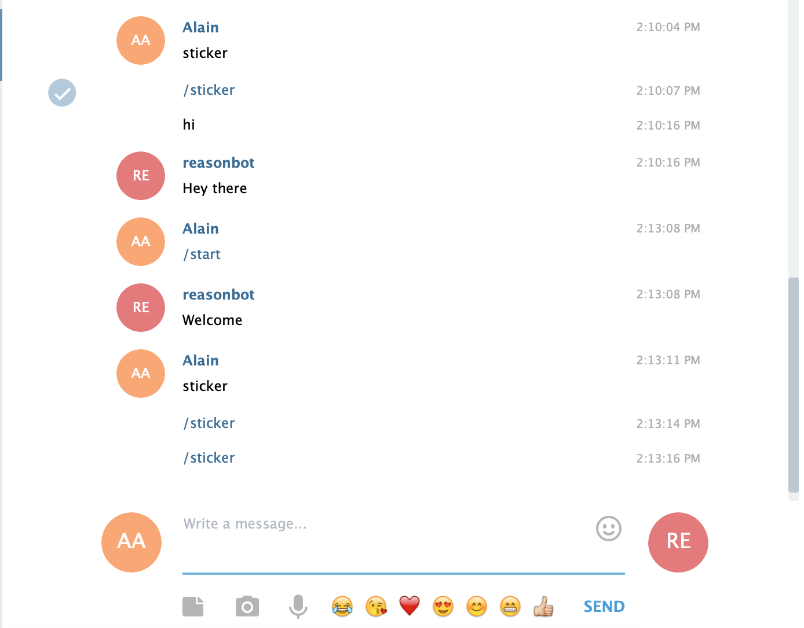
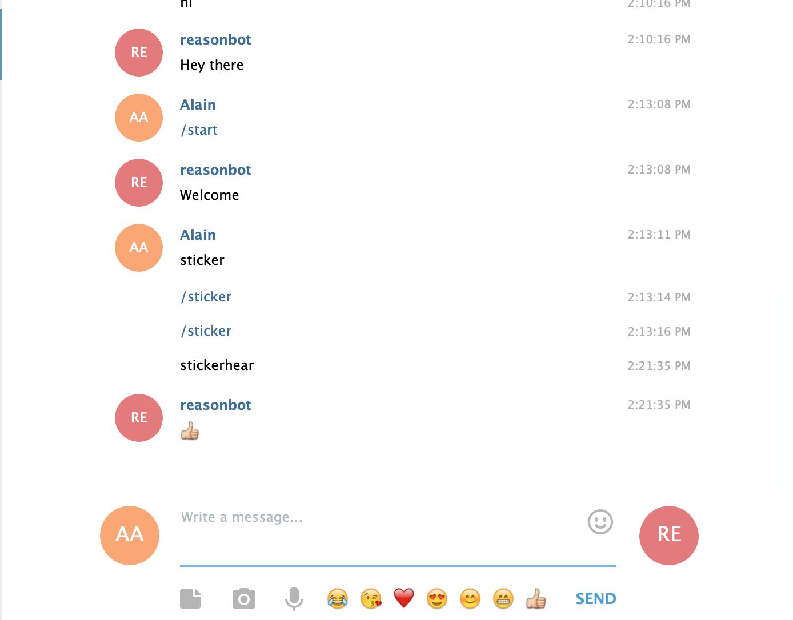

## bot.on("sticker") function not working

## Example code from repo

```js
const Telegraf = require('telegraf');
require('dotenv').config();

const bot = new Telegraf(process.env.BOT_TOKEN);
bot.start((ctx) => ctx.reply('Welcome'))
bot.help((ctx) => ctx.reply('Send me a sticker'))
bot.on('sticker', (ctx) => ctx.reply('👍'))
bot.hears('hi', (ctx) => ctx.reply('Hey there'))
bot.launch()
```

## Issue

Typeing `/sticker` or `sticker` into `Telegram` input field does nothing when a reply is expected.



If you add this line:

```js
bot.hears('stickerhear', (ctx) => ctx.reply('👍'))
```

You get the sticker bot.


